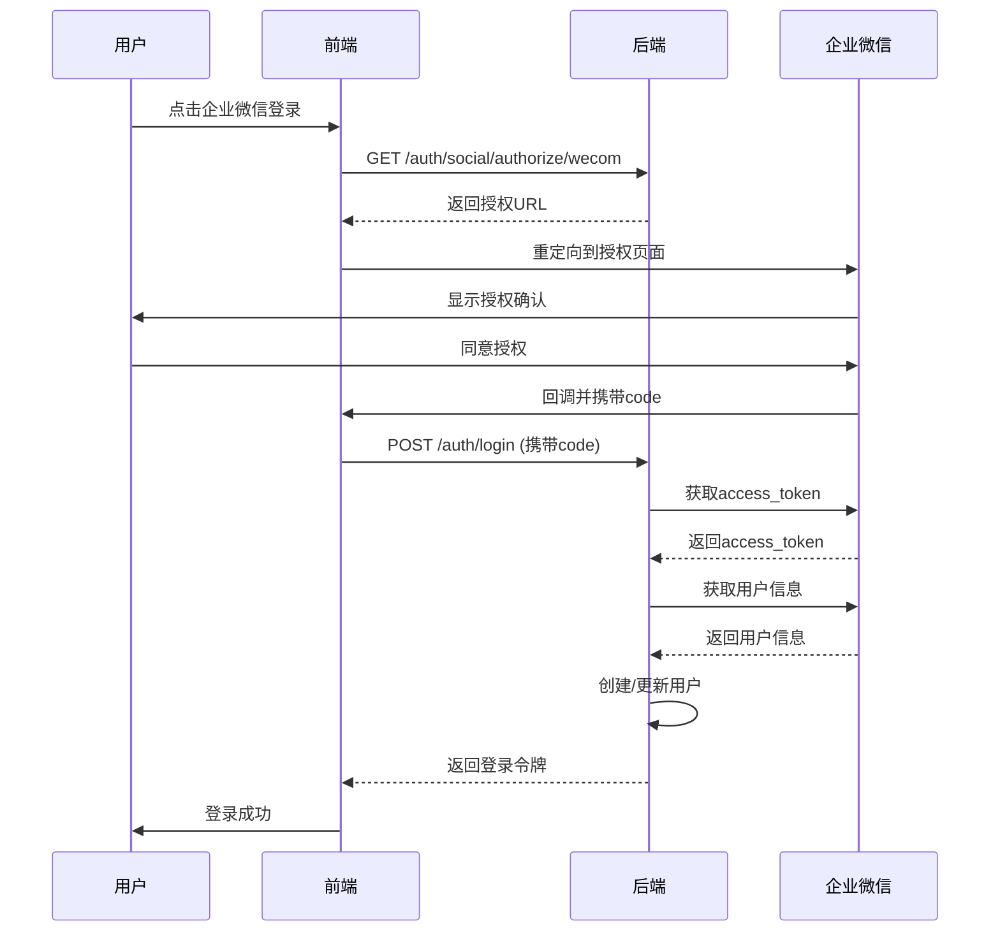

# 企业微信登录实现文档

## 📋 功能概述

实现了企业微信OAuth2.0授权登录功能，用户可以通过企业微信账号快速登录FlowMaster系统。

## 🏗️ 架构设计

### 核心组件

1. **OAuth配置管理** (`apps/system/auth/config/oauth_config.py`)
   - 管理企业微信OAuth配置
   - 支持从环境变量读取配置

2. **企业微信OAuth客户端** (`apps/system/auth/oauth/wecom_oauth.py`)
   - 生成授权URL
   - 获取access_token
   - 获取用户信息

3. **社交登录处理器** (`apps/system/auth/handler/social_login_handler.py`)
   - 处理第三方登录流程
   - 用户信息映射和存储

4. **认证服务** (`apps/system/auth/service/auth_service.py`)
   - 提供授权URL生成接口
   - 协调各组件完成登录

## 🔧 配置说明

### 1. 环境变量配置

在 `.env` 文件中添加以下配置：

```bash
# 企业微信 OAuth
OAUTH_WECOM_CLIENT_ID=your-wecom-corpid           # 企业ID (CorpID)
OAUTH_WECOM_CLIENT_SECRET=your-wecom-corpsecret   # 应用Secret (CorpSecret)
OAUTH_WECOM_AGENT_ID=your-wecom-agentid           # 应用AgentID
OAUTH_WECOM_REDIRECT_URI=http://localhost:5173/social/callback?source=wecom
```

### 2. 获取企业微信配置参数

#### 步骤1: 注册企业微信

1. 访问 [企业微信官网](https://work.weixin.qq.com/)
2. 注册企业微信账号

#### 步骤2: 创建自建应用

1. 登录企业微信管理后台
2. 进入「应用管理」→「应用」→「自建」
3. 点击「创建应用」
4. 记录以下信息：
   - **AgentId**: 应用ID
   - **Secret**: 应用Secret

#### 步骤3: 获取企业ID

1. 在管理后台「我的企业」页面
2. 找到「企业ID」（CorpID）

#### 步骤4: 配置可信域名

1. 在应用详情页面
2. 进入「网页授权及JS-SDK」
3. 设置「可信域名」为你的前端域名（如: `localhost:5173`）

## 📝 API接口

### 1. 获取授权地址

```http
GET /api/v1/auth/social/authorize/wecom?client_id=web
```

**响应示例：**
```json
{
  "success": true,
  "code": "200",
  "msg": "操作成功",
  "data": {
    "authorizeUrl": "https://open.weixin.qq.com/connect/oauth2/authorize?appid=xxx&redirect_uri=xxx&response_type=code&scope=snsapi_base&state=xxx&agentid=xxx#wechat_redirect"
  },
  "timestamp": 1234567890
}
```

### 2. 企业微信登录回调

前端接收到授权码后，调用登录接口：

```http
POST /api/v1/auth/login
Content-Type: application/json

{
  "authType": "SOCIAL",
  "source": "wecom",
  "code": "授权码",
  "state": "状态码"
}
```

## 🔄 登录流程



## 📊 数据库设计

### sys_user_social表

存储第三方账号关联信息：

| 字段 | 类型 | 说明 |
|------|------|------|
| id | BIGINT | 主键 |
| user_id | BIGINT | 关联的用户ID |
| source | VARCHAR(20) | 第三方平台(wecom) |
| open_id | VARCHAR(128) | 企业微信UserId |
| meta_json | TEXT | 用户详细信息(JSON) |
| last_login_time | DATETIME | 最后登录时间 |
| create_time | DATETIME | 创建时间 |
| update_time | DATETIME | 更新时间 |

## 🔐 安全说明

1. **State参数**: 使用UUID防止CSRF攻击
2. **HTTPS**: 生产环境必须使用HTTPS
3. **可信域名**: 仅允许配置的域名进行回调
4. **Secret保密**: 企业Secret不能泄露

## ⚠️ 注意事项

1. **开发环境限制**
   - 企业微信授权需要内网穿透或公网域名
   - 本地开发可使用ngrok等工具

2. **用户信息权限**
   - 需要在企业微信后台配置应用的数据权限
   - 确保应用有权限读取成员信息

3. **回调地址配置**
   - 前后端的redirect_uri必须一致
   - 必须在企业微信后台配置可信域名

## 🚧 待完善功能

当前实现为骨架代码，以下功能待完善：

- [ ] 用户自动注册逻辑（数据库操作）
- [ ] 第三方账号绑定功能
- [ ] 第三方账号解绑功能
- [ ] 登录日志记录
- [ ] 安全消息通知
- [ ] Gitee、GitHub登录支持

## 📚 参考文档

- [企业微信OAuth文档](https://developer.work.weixin.qq.com/document/path/91022)
- [企业微信API文档](https://developer.work.weixin.qq.com/document/)
- [参考项目: continew-admin](../refrence/continew-admin/)

## 🎯 测试指南

### 前置条件

1. 完成企业微信应用配置
2. 配置环境变量
3. 确保前后端都能访问（需要公网或内网穿透）

### 测试步骤

1. 启动后端服务
2. 启动前端服务
3. 访问登录页面
4. 点击企业微信登录按钮
5. 在企业微信授权页面确认授权
6. 验证是否成功登录

### 常见问题

**Q: 提示"redirect_uri参数错误"**
A: 检查可信域名配置是否正确，redirect_uri是否包含在可信域名中

**Q: 获取不到用户信息**
A: 检查应用是否有读取成员信息的权限

**Q: 本地开发无法回调**
A: 使用ngrok等工具进行内网穿透，并配置对应域名
